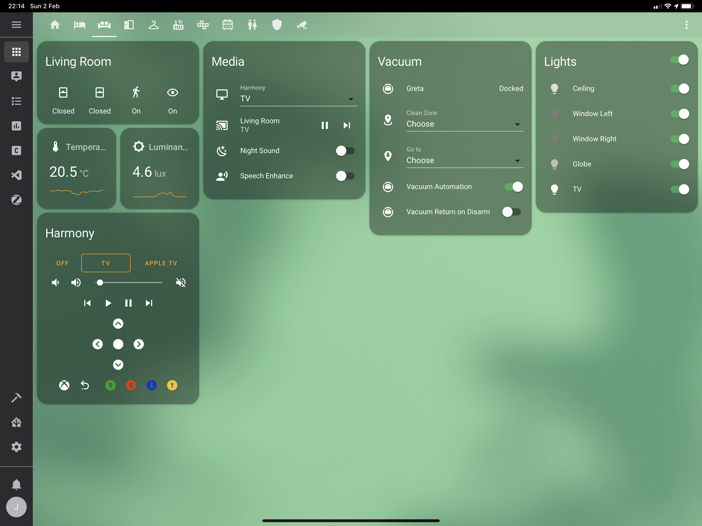

# Home Assistant Config

This is my [Home Assistant](https://home-assistant.io) configuration. The goal is to minimize manual control and leave as much as possible to automation. The configuration constantly evolves, so be sure to star the project to keep up with the updates.

## Automation

Below are some of my most used automations, which make life just a bit easier and more fun. For a complete list, have a look in the `automation/` folder of the repository.

### Lighting

- When the light in the living room is below 40 lx, enable "light mode", which means that window lamps turn on and room lighting reacts when people are in the room
- When everyone are asleep, enable night lights when motion is detected
- When a wall dimmer is used, it will override light automation for that room until it has been empty for 10 minutes, at which the automation resumes
- Full light mode which, when enabled, will run the lights at 100% when motion is detected in a room, and is very useful when cleaning the home
- Light simulation, where some lights will turn on depending on the sun even when nobody is home

### Security

- When someone is about to leave and a door or window is open in the home, a notice sound will be played
- When the last family member leaves the home, the alarm will automatically arm
- When the first family member enters the home, the alarm will automatically disarm
- When the last family member goes to sleep, the alarm will automatically arm for night
- When the first family member wakes up, the alarm will automatically disarm
- Guest mode which, when enabled, allow approved guests to be part of the alarm and sleep automation
- Dead man's switch, which will alert everyone in the household if someone is home, but has not moved for four hours (excluding sleep)
- If water is detected under the kitchen sink/dishwasher/dryer, an alert is sent to my phone

### Convenience

- When it starts to rain and a window is open, an alert is sent to my phone
- When the last person leaves and the alarm is turned on, the robot vacuum automatically starts
- If someone comes home as the robot vacuum is cleaning, it goes back to the dock

## Hardware

The following is a list of hardware deployed in the home, grouped by room. While there are currently different types of hardware, the goal is to standardize on Zigbee.

### Hubs

- Zigbee hub: [Dresden Elektronik ConBee](https://www.dresden-elektronik.de/conbee/)
- Z-wave hub: [zwave.me uzb](http://zwave.me/index.php?id=28)
- Security camera (2): [Netgear Arlo Pro VMC4030](https://www.arlo.com/en-us/products/arlo-pro/)
- Camera base station and siren: [Netgear Arlo Pro Base station with siren](https://www.arlo.com/en-us/products/arlo-pro/)

### Bedroom

- Window lamp: [IKEA Trådfri Lights E14](http://www.ikea.com/se/sv/catalog/products/70318284/)
- Ceiling lamp: [IKEA Trådfri Lights E27](http://www.ikea.com/se/sv/catalog/products/10318263/)
- Bedside lamp (2): [Xiaomi Mijia MJCTD01YL Yeelight Bedside Lamp](https://www.gearbest.com/smart-lighting/pp_1032313.html)
- Sleep/wake button (2): [Xiaomi Mi Smart Home Wireless Switch](https://xiaomi-mi.com/sockets-and-sensors/xiaomi-mi-wireless-switch/)
- Wall dimmer: [IKEA Trådfri Dimmer](http://www.ikea.com/us/en/catalog/products/00347831/)
- Window sensor: [Xiaomi Mi Smart Home Door / Window Sensor](https://xiaomi-mi.com/sockets-and-sensors/xiaomi-mi-door-window-sensors/)
- Motion sensor: [Xiaomi Mi Smart Home Occupancy Sensor](https://xiaomi-mi.com/sockets-and-sensors/xiaomi-mi-occupancy-sensor/)
- Temperature / humidity sensor: [Xiaomi Mi Smart Home Temperature / Humidity Sensor](https://xiaomi-mi.com/sockets-and-sensors/xiaomi-mi-temperature-humidity-sensor/)

### Living Room

- Window lamp: [IKEA Trådfri Lights E14](http://www.ikea.com/se/sv/catalog/products/70318284/)
- Ceiling lamp: [Philips Hue White and Color Ambiance E27](https://www2.meethue.com/en-us/p/hue-white-and-color-ambiance-single-bulb-e26/046677464486)
- Globe lamp: [Philips Hue White and Color Ambiance E14](https://www2.meethue.com/en-us/p/hue-white-and-color-ambiance-single-bulb-e12/046677468903)
- TV backlight: [Xiaomi Yeelight Lightstrip](https://xiaomi-mi.com/smart-lighting/xiaomi-yeelight-smart-led-lightstrip-ipl/)
- Wall dimmer: [IKEA Trådfri Dimmer](http://www.ikea.com/us/en/catalog/products/00347831/)
- Motion sensor: [Philips Hue Motion Sensor](https://www2.meethue.com/en-us/p/hue-motion-sensor/046677473389)
- Window and door sensor (3): [Xiaomi Mi Smart Home Door / Window Sensor](https://xiaomi-mi.com/sockets-and-sensors/xiaomi-mi-door-window-sensors/)
- TV remote: [Logitech Harmony Companion](https://www.logitech.com/en-us/product/harmony-companion)
- Robot Vacuum: [Xiaomi Roborock S50](https://www.aliexpress.com/item/International-Version-Xiaomi-Roborock-S50-Robot-Vacuum-Cleaner-2-WIFI-APP-Control-Wet-Mop-Smart-Planned/32837327014.html)

### Closet

- Air intake fan wall plug: [Osram SMART+ Plug](https://www.osram-lamps.com/ecatalog/smart-home/smart-home-components/smart-plug/index.jsp)

### Bathroom

- Ceiling lamp (3): [IKEA Trådfri Lights GU10](http://www.ikea.com/se/sv/catalog/products/00318292/)
- Window sensor: [Xiaomi Mi Smart Home Door / Window Sensor](https://xiaomi-mi.com/sockets-and-sensors/xiaomi-mi-door-window-sensors/)
- Temperature / humidity sensor: [Xiaomi Mi Smart Home Temperature / Humidity Sensor](https://xiaomi-mi.com/sockets-and-sensors/xiaomi-mi-temperature-humidity-sensor/)
- Washer water leak sensor: [Xiaomi Mijia Aqara Water sensor](https://xiaomi-mi.com/sockets-and-sensors/xiaomi-mijia-aqara-water-sensor/)

### Hallway

- Ceiling lamp: [Philips Hue Aurelle Round](https://www2.meethue.com/sv-se/p/hue-white-ambiance-aurelle-rund-panelbelysning/3216431P5)
- Mirror light wall plug: [Osram SMART+ Plug](https://www.osram-lamps.com/ecatalog/smart-home/smart-home-components/smart-plug/index.jsp)
- Wall dimmer: [IKEA Trådfri Dimmer](http://www.ikea.com/us/en/catalog/products/00347831/)
- Motion sensor: [Xiaomi Mi Smart Home Occupancy Sensor](https://xiaomi-mi.com/sockets-and-sensors/xiaomi-mi-occupancy-sensor/)
- Main entrance door sensor: [Xiaomi Mi Smart Home Door / Window Sensor](https://xiaomi-mi.com/sockets-and-sensors/xiaomi-mi-door-window-sensors/)

### Kitchen

- Window lamp: [IKEA Trådfri Lights E14](http://www.ikea.com/se/sv/catalog/products/70318284/)
- Ceiling lamp: [Philips Hue Cher Suspension Light](https://www2.meethue.com/en-us/p/hue-white-ambiance-cher-suspension-light/4076130U7)
- Cabinet lighting: [IKEA Trådfri 30W Transformer](https://www.ikea.com/se/sv/catalog/products/60342656/)
- Countertop lighting: [Osram Lightify LED Strip](https://smartplus.ledvance.com/products/index.jsp)
- Window lighting wall plug: [Osram SMART+ Plug](https://www.osram-lamps.com/ecatalog/smart-home/smart-home-components/smart-plug/index.jsp)
- Wall dimmer: [Philips Hue Dimmer Switch](https://www2.meethue.com/en-us/p/hue-dimmer-switch/046677473372)
- Motion sensor: [Xiaomi Mi Smart Home Occupancy Sensor](https://xiaomi-mi.com/sockets-and-sensors/xiaomi-mi-occupancy-sensor/)
- Window sensors: [Xiaomi Mi Smart Home Door / Window Sensor](https://xiaomi-mi.com/sockets-and-sensors/xiaomi-mi-door-window-sensors/)
- Dishwasher / sink water leak sensor: [Xiaomi Mijia Aqara Water sensor](https://xiaomi-mi.com/sockets-and-sensors/xiaomi-mijia-aqara-water-sensor/)

### Guest Bedroom

- Window lamp: [IKEA Trådfri Lights E14](http://www.ikea.com/se/sv/catalog/products/70318284/)
- Ceiling lamp: [IKEA Trådfri Lights E27](http://www.ikea.com/se/sv/catalog/products/10318263/)
- Wall dimmer: [IKEA Trådfri Dimmer](http://www.ikea.com/us/en/catalog/products/00347831/)
- Motion sensor: [Xiaomi Mi Smart Home Occupancy Sensor](https://xiaomi-mi.com/sockets-and-sensors/xiaomi-mi-occupancy-sensor/)
- Window sensor: [Xiaomi Mi Smart Home Door / Window Sensor](https://xiaomi-mi.com/sockets-and-sensors/xiaomi-mi-door-window-sensors/)
- Guest sleep/wake button: [Xiaomi Mi Smart Home Wireless Switch](https://xiaomi-mi.com/sockets-and-sensors/xiaomi-mi-wireless-switch/)

## Screenshots

Note that these screenshots are provided in a best-effort manner, and may not reflect the current state of the configuration.

