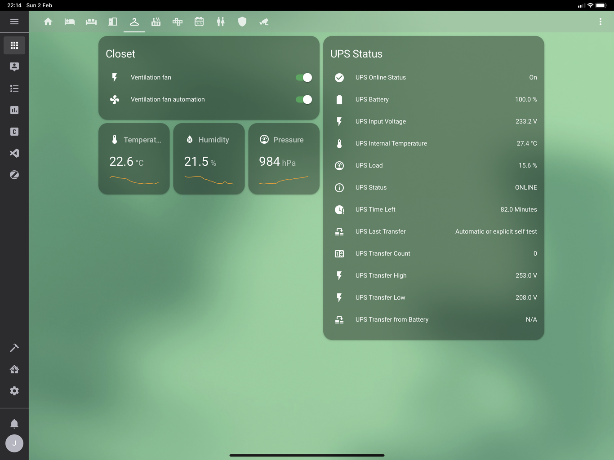
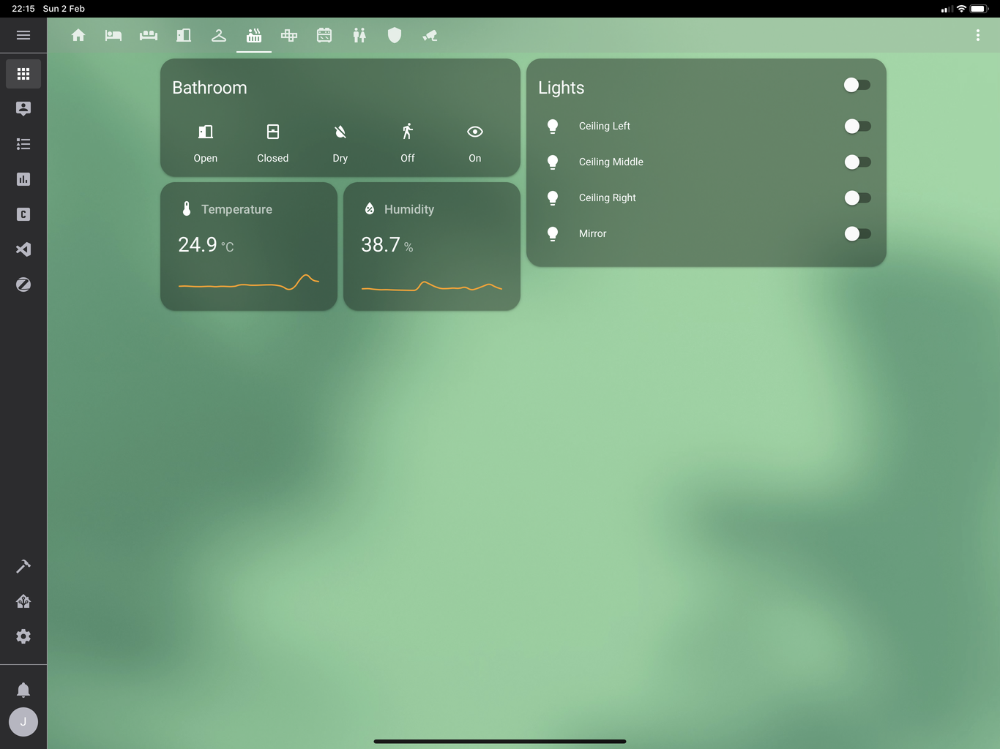
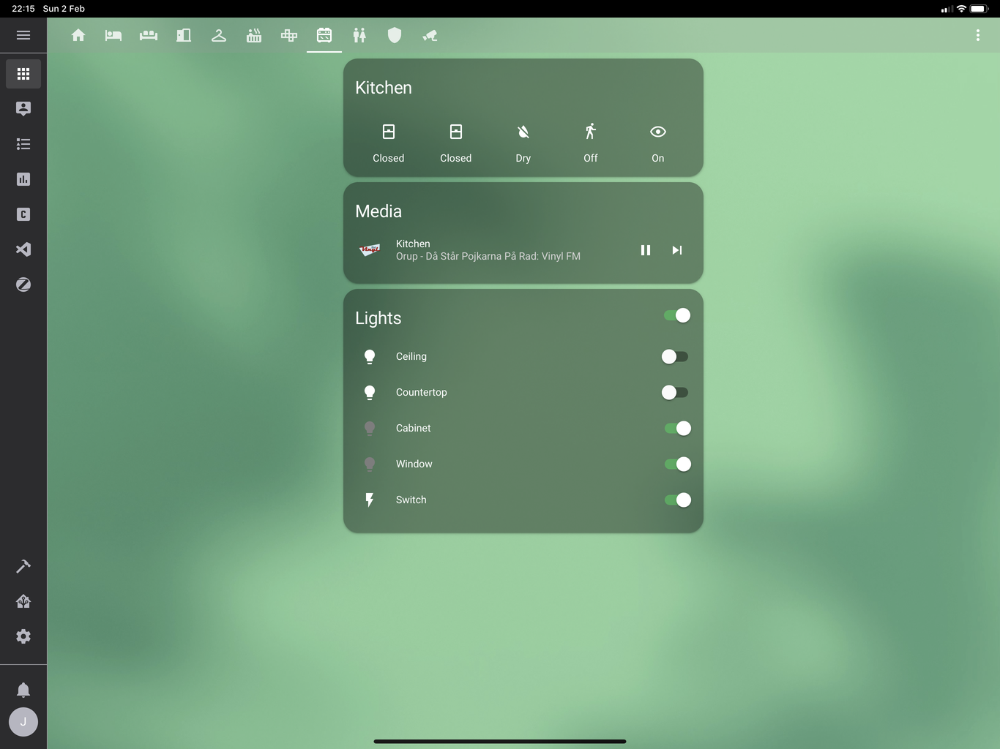

# Home Assistant Config

**Note**: Builds will fail until the next release where Arlo support is built-in.

This is my [Home Assistant](https://home-assistant.io) configuration.

## Devices

- [zwave.me uzb](http://zwave.me/index.php?id=28) x1
- [Fibaro FGWPF-102 ZW5 Wall Plug](https://www.fibaro.com/en/products/wall-plug/) x2
- [Fibaro FGMS-001 ZW5 Motion Sensor](https://www.fibaro.com/en/products/motion-sensor/) x1
- [Fibaro Smoke Sensor FGSD-002](https://www.fibaro.com/en/products/smoke-sensor/) x1
- [IKEA Trådfri Gateway](http://www.ikea.com/us/en/catalog/products/00337813/) x1
- [IKEA Trådfri Remote](http://www.ikea.com/us/en/catalog/products/20303317/) x1
- [IKEA Trådfri Lights E14](http://www.ikea.com/se/sv/catalog/products/70318284/) x3
- [Netgear Arlo Pro VMC4030](https://www.arlo.com/en-us/products/arlo-pro/) x2
- [Netgear Arlo Pro Base station with siren](https://www.arlo.com/en-us/products/arlo-pro/) x1

## Screenshots

