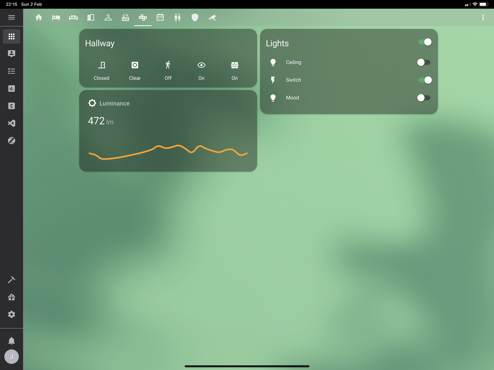

# Home Assistant Config

_builds will fail until Home Assistant 0.61 (with deconz support) is officially released_

This is my [Home Assistant](https://home-assistant.io) configuration. The goal is to minimize manual control and leave as much as possible to automation. The configuration constantly evolves, so be sure to star the project to keep up with the updates.

## Devices

### Hubs

- [zwave.me uzb](http://zwave.me/index.php?id=28) x1
- ~~[IKEA Trådfri Gateway](http://www.ikea.com/us/en/catalog/products/00337813/) x1~~ all ikea hardware is paired with conbee
- ~~[Xiaomi Mi Smart Home Gateway 2](https://xiaomi-mi.com/sockets-and-sensors/xiaomi-mi-gateway-2/)~~ all xiaomi hardware is paired with conbee
- [Dresden Elektronik ConBee](https://www.dresden-elektronik.de/conbee/) x1
- [Logitech Harmony Companion](https://www.logitech.com/en-us/product/harmony-companion) x1

### Lights

- [IKEA Trådfri Lights E14](http://www.ikea.com/se/sv/catalog/products/70318284/) x4
- [IKEA Trådfri Lights GU10](http://www.ikea.com/se/sv/catalog/products/00318292/) x3
- [Xiaomi Yeelight Lightstrip](https://xiaomi-mi.com/smart-lighting/xiaomi-yeelight-smart-led-lightstrip-ipl/) x1

### Switches

- [IKEA Trådfri Remote](http://www.ikea.com/us/en/catalog/products/20303317/) x1
- [Xiaomi Mi Smart Home Wireless Switch](https://xiaomi-mi.com/sockets-and-sensors/xiaomi-mi-wireless-switch/) x4

### Sensors

- [Fibaro FGMS-001 ZW5 Motion Sensor](https://www.fibaro.com/en/products/motion-sensor/) x1
- [Fibaro Smoke Sensor FGSD-002](https://www.fibaro.com/en/products/smoke-sensor/) x1
- [Xiaomi Mi Smart Home Occupancy Sensor](https://xiaomi-mi.com/sockets-and-sensors/xiaomi-mi-occupancy-sensor/) x5
- [Xiaomi Mi Smart Home Door / Window Sensors](https://xiaomi-mi.com/sockets-and-sensors/xiaomi-mi-door-window-sensors/) x7
- [Xiaomi Mi Smart Home Temperature / Humidity Sensor](https://xiaomi-mi.com/sockets-and-sensors/xiaomi-mi-temperature-humidity-sensor/) x4

### Actors

- [Fibaro FGWPF-102 ZW5 Wall Plug](https://www.fibaro.com/en/products/wall-plug/) x3

### Cameras

- [Netgear Arlo Pro VMC4030](https://www.arlo.com/en-us/products/arlo-pro/) x2
- [Netgear Arlo Pro Base station with siren](https://www.arlo.com/en-us/products/arlo-pro/) x1

## Screenshots

Note that these screenshots are provided in a best-effort manner, and may not reflect the current state of the configuration.

