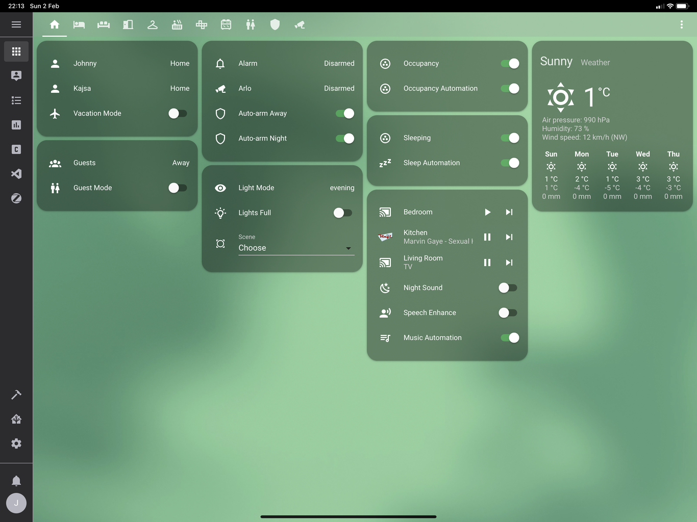
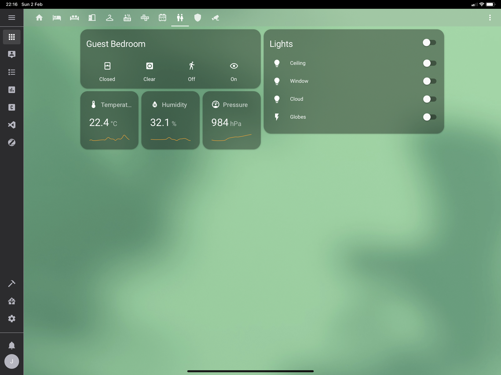
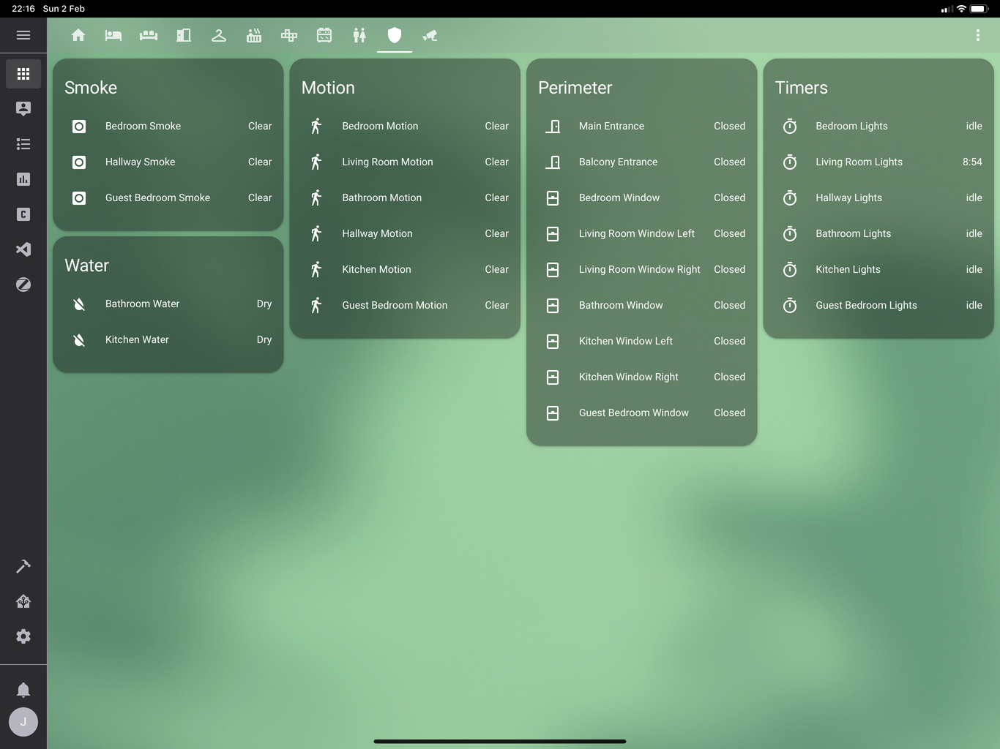

# Home Assistant Config

This is my [Home Assistant](https://home-assistant.io) configuration. The goal is to minimize manual control and leave as much as possible to automation. The configuration constantly evolves, so be sure to star the project to keep up with the updates.

# Hardware

The list following is a list of hardware deployed in the home, grouped by room.

## Home

- Zigbee hub: [Dresden Elektronik ConBee](https://www.dresden-elektronik.de/conbee/)
- Z-wave hub: [zwave.me uzb](http://zwave.me/index.php?id=28)
- TV remote: [Logitech Harmony Companion](https://www.logitech.com/en-us/product/harmony-companion)
- Security camera (2): [Netgear Arlo Pro VMC4030](https://www.arlo.com/en-us/products/arlo-pro/)
- Camera base station and siren: [Netgear Arlo Pro Base station with siren](https://www.arlo.com/en-us/products/arlo-pro/)

## Bedroom

- Window lamp: [IKEA Trådfri Lights E14](http://www.ikea.com/se/sv/catalog/products/70318284/)
- Ceiling lamp: [IKEA Trådfri Lights E27](http://www.ikea.com/se/sv/catalog/products/10318263/)
- Bedside lamps: [Xiaomi Mijia MJCTD01YL Yeelight Bedside Lamp](https://www.gearbest.com/smart-lighting/pp_1032313.html)
- Wall dimmer: [IKEA Trådfri Dimmer](http://www.ikea.com/us/en/catalog/products/00347831/)
- Motion sensor: [Xiaomi Mi Smart Home Occupancy Sensor](https://xiaomi-mi.com/sockets-and-sensors/xiaomi-mi-occupancy-sensor/)
- Sleep detection: [Fibaro FGWPF-102 ZW5 Wall Plug](https://www.fibaro.com/en/products/wall-plug/) x2
- Window sensor: [Xiaomi Mi Smart Home Door / Window Sensor](https://xiaomi-mi.com/sockets-and-sensors/xiaomi-mi-door-window-sensors/)

## Living Room

- Window lamp: [IKEA Trådfri Lights E14](http://www.ikea.com/se/sv/catalog/products/70318284/)
- Ceiling lamp: [Philips Hue White and Color Ambiance E27](https://www2.meethue.com/en-us/p/hue-white-and-color-ambiance-single-bulb-e26/046677464486)
- Globe lamp: [Philips Hue White and Color Ambiance E14](https://www2.meethue.com/en-us/p/hue-white-and-color-ambiance-single-bulb-e12/046677468903)
- Wall dimmer: [IKEA Trådfri Dimmer](http://www.ikea.com/us/en/catalog/products/00347831/)
- Motion sensor: [Fibaro FGMS-001 ZW5 Motion Sensor](https://www.fibaro.com/en/products/motion-sensor/)
- TV backlight: [Xiaomi Yeelight Lightstrip](https://xiaomi-mi.com/smart-lighting/xiaomi-yeelight-smart-led-lightstrip-ipl/)
- Currently unused wall plug: [Osram SMART+ Plug](https://www.osram-lamps.com/ecatalog/smart-home/smart-home-components/smart-plug/index.jsp)
- Two windows and door sensor: [Xiaomi Mi Smart Home Door / Window Sensor](https://xiaomi-mi.com/sockets-and-sensors/xiaomi-mi-door-window-sensors/)

## Hallway

- Window lamp (3 lamps): [IKEA Trådfri Lights GU10](http://www.ikea.com/se/sv/catalog/products/00318292/)
- Wall dimmer: [IKEA Trådfri Dimmer](http://www.ikea.com/us/en/catalog/products/00347831/)
- Motion sensor: [Xiaomi Mi Smart Home Occupancy Sensor](https://xiaomi-mi.com/sockets-and-sensors/xiaomi-mi-occupancy-sensor/)
- Currently unused wall plug: [Fibaro FGWPF-102 ZW5 Wall Plug](https://www.fibaro.com/en/products/wall-plug/)
- Main entrance door sensor: [Xiaomi Mi Smart Home Door / Window Sensor](https://xiaomi-mi.com/sockets-and-sensors/xiaomi-mi-door-window-sensors/)

## Bathroom

- Window sensor: [Xiaomi Mi Smart Home Door / Window Sensor](https://xiaomi-mi.com/sockets-and-sensors/xiaomi-mi-door-window-sensors/)

## Kitchen

- Motion sensor: [Xiaomi Mi Smart Home Occupancy Sensor](https://xiaomi-mi.com/sockets-and-sensors/xiaomi-mi-occupancy-sensor/)
- Cabinet lighting: [IKEA Trådfri 30W Transformer](https://www.ikea.com/se/sv/catalog/products/60342656/)
- Countertop lighting: [Osram Lightify LED Strip](https://smartplus.ledvance.com/products/index.jsp)
- Window lamp: [IKEA Trådfri Lights E14](http://www.ikea.com/se/sv/catalog/products/70318284/)
- Ceiling lamp: [Philips Hue Cher Suspension Light](https://www2.meethue.com/en-us/p/hue-white-ambiance-cher-suspension-light/4076130U7)
- Window sensors: [Xiaomi Mi Smart Home Door / Window Sensor](https://xiaomi-mi.com/sockets-and-sensors/xiaomi-mi-door-window-sensors/)
- Wall dimmer: [Philips Hue Dimmer Switch](https://www2.meethue.com/en-us/p/hue-dimmer-switch/046677473372)

## Guest Bedroom

- Motion sensor: [Xiaomi Mi Smart Home Occupancy Sensor](https://xiaomi-mi.com/sockets-and-sensors/xiaomi-mi-occupancy-sensor/)
- Window lamp: [IKEA Trådfri Lights E14](http://www.ikea.com/se/sv/catalog/products/70318284/)
- Ceiling lamp: [IKEA Trådfri Lights E27](http://www.ikea.com/se/sv/catalog/products/10318263/
- Wall dimmer: [IKEA Trådfri Dimmer](http://www.ikea.com/us/en/catalog/products/00347831/)
- Guest sleep/wake button: [Xiaomi Mi Smart Home Wireless Switch](https://xiaomi-mi.com/sockets-and-sensors/xiaomi-mi-wireless-switch/)
- Window sensor: [Xiaomi Mi Smart Home Door / Window Sensor](https://xiaomi-mi.com/sockets-and-sensors/xiaomi-mi-door-window-sensors/)

# Screenshots

Note that these screenshots are provided in a best-effort manner, and may not reflect the current state of the configuration.

